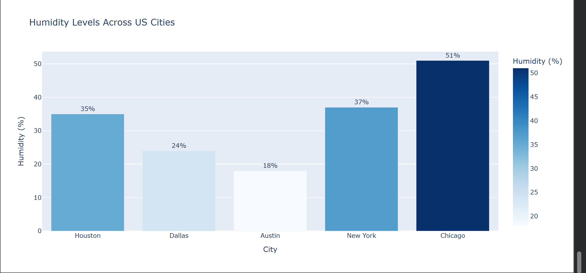
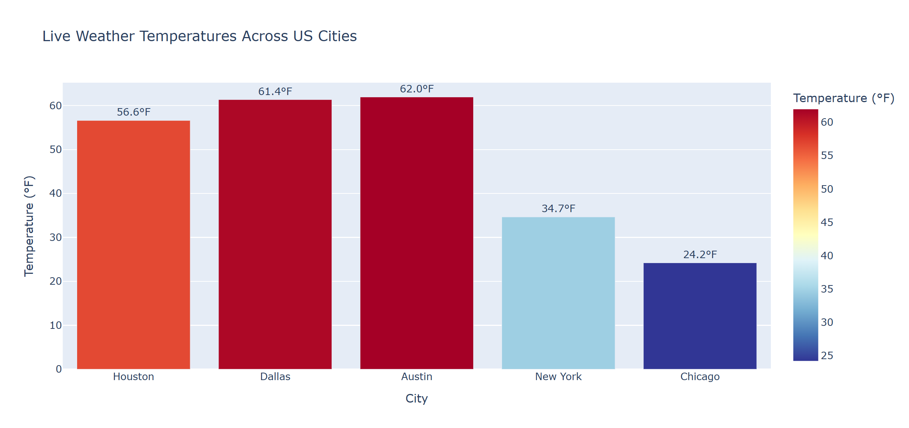

# Weather ETL Pipeline

An end-to-end data engineering pipeline that extracts real-time 
weather data, transforms it, and loads it into a data warehouse.

## What it does
- Extracts live weather data from OpenWeatherMap API for 5 US cities
- Transforms and cleans data using Python and Pandas
- Loads into DuckDB local data warehouse
- Analyzes data using SQL queries
- Visualizes results with interactive Plotly dashboards
- Includes data quality checks and Airflow DAG structure

## Tools Used
- Python
- Pandas
- DuckDB
- Plotly
- OpenWeatherMap API
- Apache Airflow (DAG structure)
- Google Colab

## Pipeline Architecture
Extract → Transform → Load → Analyze → Visualize

## Key Findings
- Tracked 5 US cities in real time
- Austin was hottest at 63.6°F
- Chicago was coldest at 24.6°F
- Chicago had highest humidity at 51%
- Austin had lowest humidity at 19%
- All data quality checks passed

## Dashboard Screenshots

## How to Run
1. Get free API key from openweathermap.org
2. Open the notebook in Google Colab
3. Replace API_KEY with your key
4. Run all cells in order
