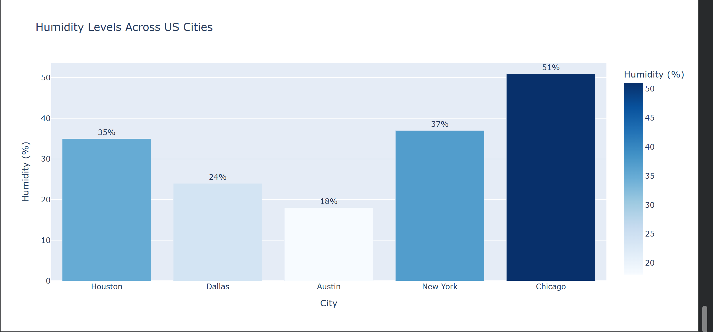
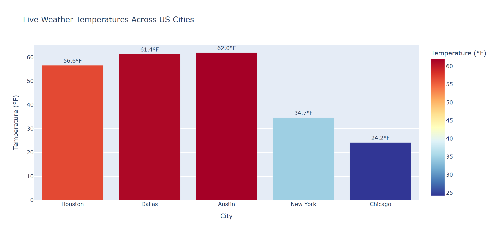

# weather-etl-pipeline

End-to-end weather ETL pipeline that extracts real-time data from the OpenWeatherMap API
for 10 US cities, transforms with Pandas, loads into DuckDB, and runs daily via Airflow.

---

## pipeline architecture

```
extract (OpenWeatherMap REST API — 5 cities in notebook, 10 in Airflow DAG)
        ↓
transform (Pandas — add temp_c, heat_index category, date partition)
        ↓
data quality assertions (temperature range, humidity range, null checks)
        ↓
load → DuckDB (weather_warehouse.db — append-only, preserves history)
        ↓
analytical SQL (daily city ranking, hottest/coldest city)
        ↓
Airflow DAG (daily, catchup=False, retries=3, exponential backoff)
```

---

## stack

| Layer | Tool |
|---|---|
| Data source | OpenWeatherMap REST API |
| Extract | Python, Requests (exponential backoff retry) |
| Transform | Pandas |
| Warehouse | DuckDB (append-only table) |
| Orchestration | Apache Airflow |
| Visualization | Plotly |
| Secrets | python-dotenv (.env file, key never in code) |

---

## cities tracked (5 US cities in notebook, 10 in Airflow DAG)

Notebook run: Houston · Dallas · Austin · New York · Chicago

Airflow DAG also covers: San Antonio · Los Angeles · Phoenix · Seattle · Miami

---

## key findings (from notebook run)

| City | Temp (°F) | Humidity | Condition |
|---|---|---|---|
| Austin | 61.95 | 18% | Broken Clouds |
| Dallas | 61.36 | 24% | Broken Clouds |
| Houston | 56.61 | 35% | Clear Sky |
| New York | 34.65 | 62% | Overcast |
| Chicago | 24.21 | 57% | Cold |

- Austin hottest at 61.95°F
- Chicago coldest at 24.21°F
- New York highest humidity at 62%
- Dallas lowest humidity at 24%
- All 4 quality checks passed (missing values, temp range, cities loaded, duplicates)

---

## airflow dag

**DAG ID:** `weather_etl_pipeline` | **Schedule:** Daily | **Catchup:** False | **Retries:** 3

```
extract_weather >> transform_weather >> load_weather >> analytical_queries
```

The extract task uses exponential backoff retry (waits 1s, 2s, 4s) on API failures
before marking a city as unavailable rather than failing the whole run.

---

## dashboard






---

## how to run

```bash
git clone https://github.com/Shibin2000/weather-etl-pipeline
cd weather-etl-pipeline
pip install -r requirements.txt
cp .env.example .env
# add your OpenWeatherMap API key to .env

# notebook
jupyter notebook weather_etl_pipeline.ipynb

# airflow
cp dags/weather_dag.py $AIRFLOW_HOME/dags/
airflow variables set OPENWEATHER_API_KEY your_key_here
airflow dags trigger weather_etl_pipeline
```
